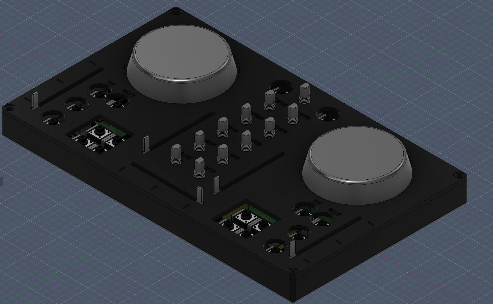
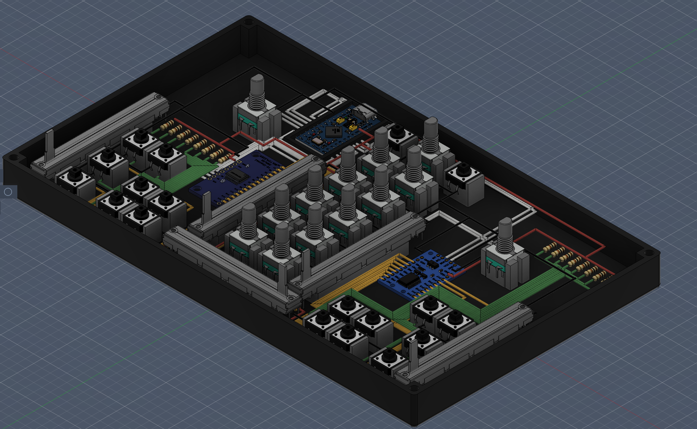
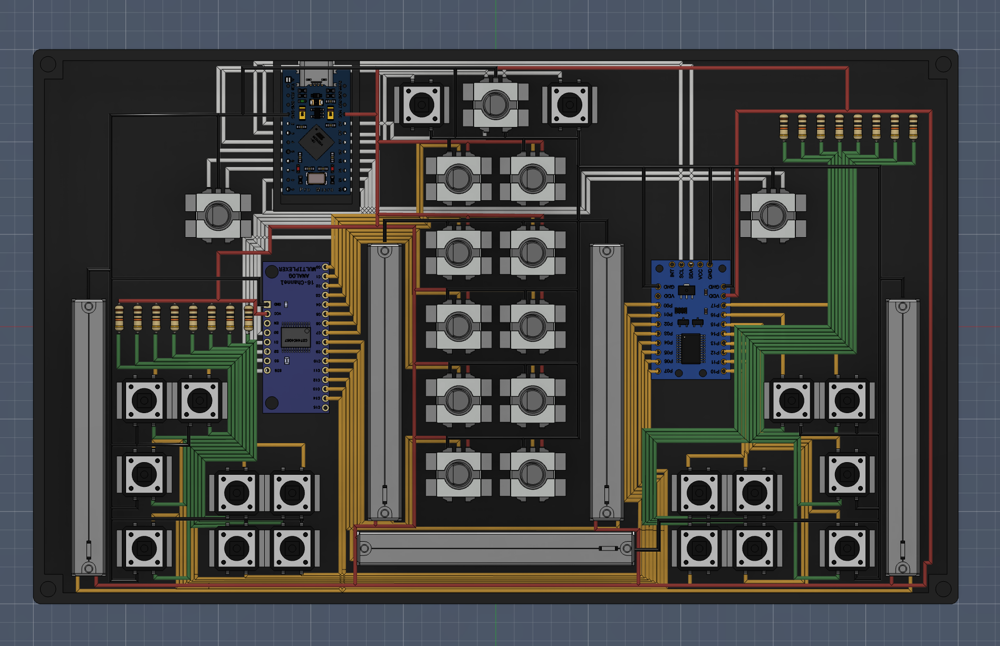
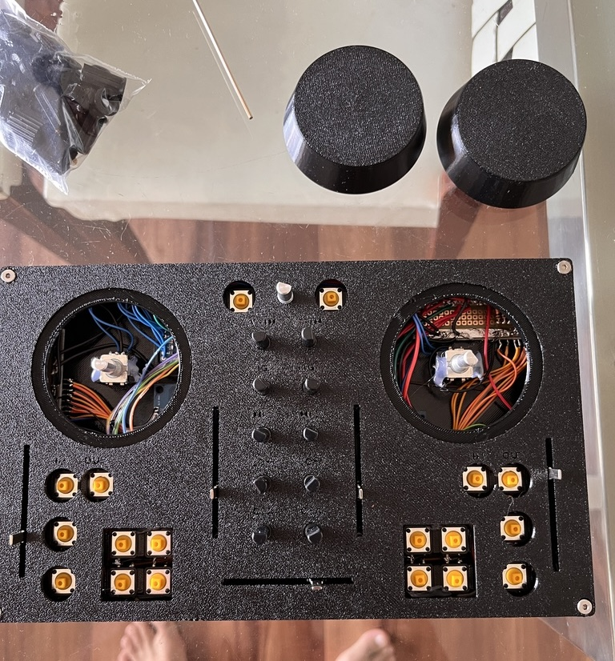
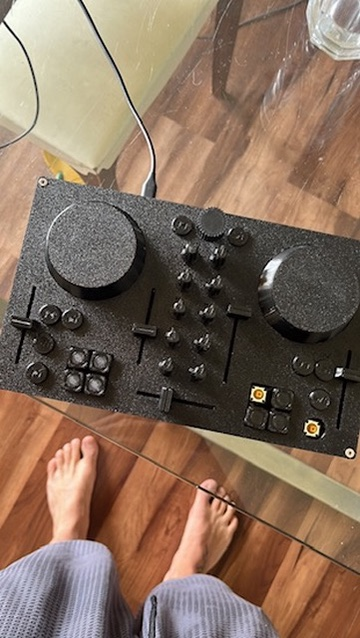
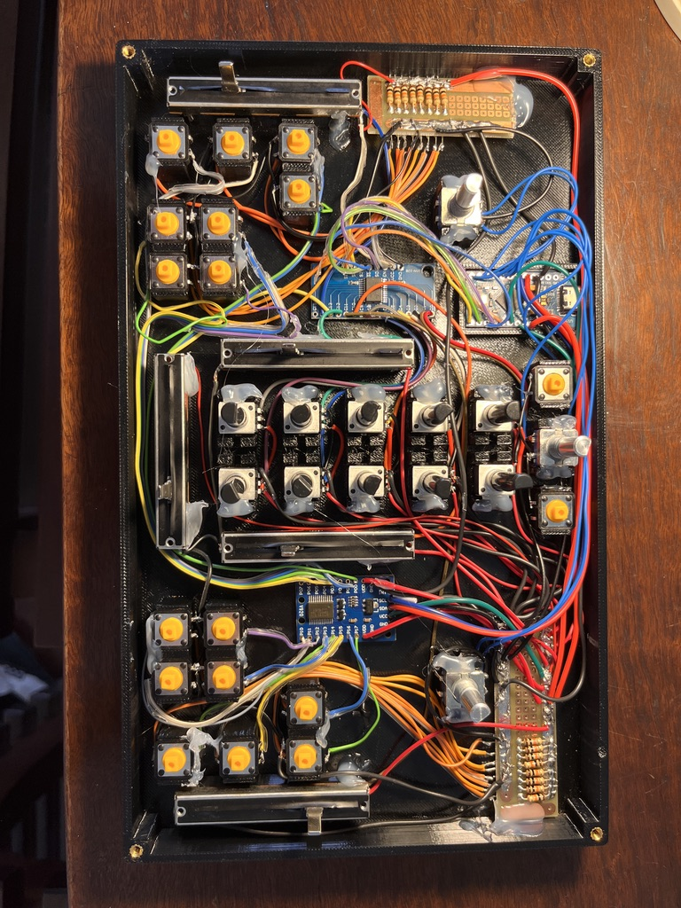
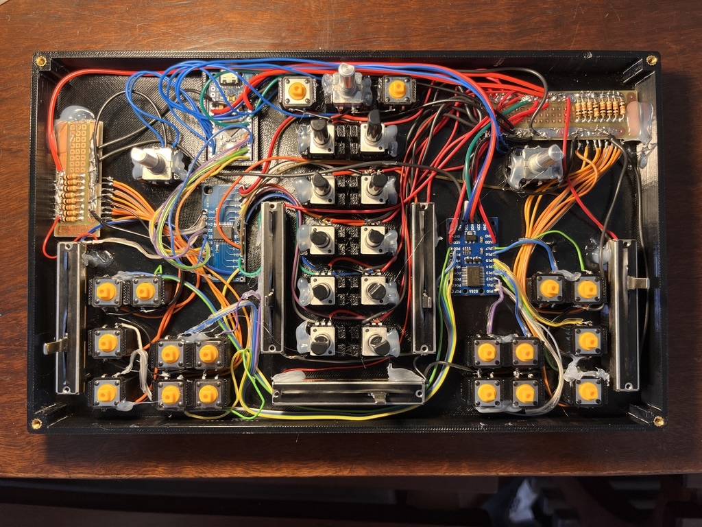
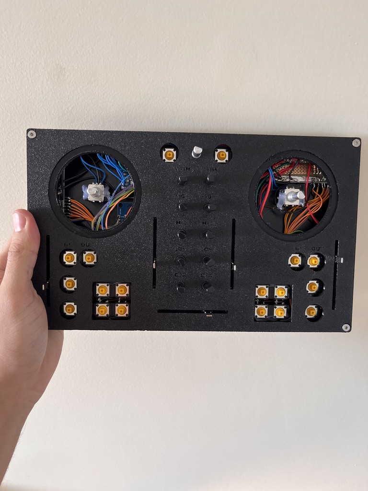

# DIY DJ Controller

Custom homemade CDJ-style DJ controller with a 3D-printed enclosure, hand-built electronics, and USB-MIDI firmware for desktop DJ software.

This project was inspired by my friend [@mandiclab](https://github.com/mandiclab) and the [djc-diy](https://github.com/mandiclab/djc-diy) project.

This repository contains the current working prototype, the design assets, the firmware, the Mixxx mapping, and the practical build information needed to continue improving the controller.

## Project Overview

- **Type:** DIY USB-MIDI DJ controller
- **MCU:** Sparkfun Pro Micro (ATmega328p @ 16 MHz)
- **Firmware stack:** PlatformIO + Arduino + `MIDIUSB`
- **Current DJ software path:** Mixxx mapping included in the repo
- **Mechanical design:** Fusion 360 model in `CDJv2.f3z`
- **Current hardware state:** hand-wired prototype, working but still under refinement

## Gallery

### Design Renders

<p align="center">
  
</p>

<table>
  <tr>
    <td align="center"><br /><sub>Fusion 360 render</sub></td>
    <td align="center"><br /><sub>Fusion 360 render</sub></td>
  </tr>
</table>

### Prototype Build Photos

<table>
  <tr>
    <td align="center"><br /><sub>Controller top view</sub></td>
    <td align="center"><br /><sub>Controller top view</sub></td>
  </tr>
  <tr>
    <td align="center"><br /><sub>Electronics assembly</sub></td>
    <td align="center"><br /><sub>Electronics assembly</sub></td>
  </tr>
  <tr>
    <td align="center" colspan="2"><br /><sub>Work-in-progress assembly</sub></td>
  </tr>
</table>

## Current Status

The controller has already been designed, assembled, flashed, and used successfully as a working prototype.

The project is now focused on:

- fixing and refining control mappings
- improving firmware clarity and maintainability
- preparing for a future PCB version
- improving the mechanical design for later revisions

## What The Controller Does

- Sends USB-MIDI messages using the `MIDIUSB` library
- Supports two-deck transport and loop control
- Reads 16 button inputs through a `PCF8575` I2C expander
- Reads 15 analog controls through a `74HC4067` multiplexer
- Uses three rotary encoders for two jog wheels and music browsing
- Includes a Mixxx mapping package in `CDJ_firmware/mixx_Mapping/`

## Hardware Summary

The current prototype is built around:

- Sparkfun Pro Micro 16 MHz
- PCF8575 I2C GPIO expander
- 74HC4067 16-channel analog multiplexer
- Three rotary encoders
- Multiple buttons and potentiometers for deck and mixer controls
- A custom 3D-printed enclosure designed in Fusion 360

### Wiring Summary

#### I2C

- SDA -> Arduino pin 2
- SCL -> Arduino pin 3
- PCF8575 address in current firmware: `0x24`

#### 74HC4067 Multiplexer

- Signal -> `A0`
- `S0` -> pin 15
- `S1` -> pin 14
- `S2` -> pin 16
- `S3` -> pin 10

#### Rotary Encoders

- Music selector -> pins 4 and 5
- Jog wheel 1 -> pins 8 and 9
- Jog wheel 2 -> pins 6 and 7

#### Direct Buttons

- `A3` -> Note 76
- `A2` -> Note 77
- `A1` -> Note 78

### Current Input Map

#### PCF8575 Buttons

Deck 1:

- Button 0 -> Loop Out
- Button 1 -> Loop In
- Button 2 -> Hotcue 3
- Button 3 -> Hotcue 4
- Button 4 -> Hotcue 1
- Button 5 -> Hotcue 2
- Button 6 -> Cue
- Button 7 -> Play/Pause

Deck 2:

- Button 8 -> Hotcue 4
- Button 9 -> Hotcue 3
- Button 10 -> Hotcue 1
- Button 11 -> Hotcue 2
- Button 12 -> Cue
- Button 13 -> Play/Pause
- Button 14 -> Loop In
- Button 15 -> Loop Out

#### Potentiometers

- Pot 0 -> Deck 1 Gain
- Pot 1 -> Deck 2 Gain
- Pot 2 -> Deck 1 High EQ
- Pot 3 -> Deck 2 High EQ
- Pot 4 -> Deck 1 Mid EQ
- Pot 5 -> Deck 2 Mid EQ
- Pot 6 -> Deck 1 Low EQ
- Pot 7 -> Deck 2 Low EQ
- Pot 8 -> Deck 1 Filter
- Pot 9 -> Deck 2 Filter
- Pot 10 -> Deck 2 Volume
- Pot 11 -> Deck 2 Tempo
- Pot 12 -> Deck 1 Volume
- Pot 13 -> Crossfader
- Pot 14 -> Deck 1 Tempo

#### Browser Controls

- Music encoder -> playlist scroll
- `A3` / Note 76 -> Load selected track into Deck 1
- `A2` / Note 77 -> Load selected track into Deck 2
- `A1` / Note 78 -> Enter folder / `GoToItem`

## Firmware

The firmware lives in `CDJ_firmware/src/main.cpp`.

### Current Behavior

- Polls the PCF8575 for 16 button inputs
- Polls the 74HC4067 for 15 analog controls
- Reads direct button inputs on `A1`, `A2`, and `A3`
- Reads three rotary encoders
- Sends USB-MIDI note and CC messages through `MIDIUSB`

### Build Configuration

`CDJ_firmware/platformio.ini` currently targets:

```ini
[env:sparkfun_promicro16]
platform = atmelavr
board = sparkfun_promicro16
framework = arduino
lib_deps =
  arduino-libraries/MIDIUSB @ ^1.0.5
```

## Mixxx Mapping

The Mixxx mapping files are:

- `CDJ_firmware/mixx_Mapping/DJC-DIY.midi.xml`
- `CDJ_firmware/mixx_Mapping/DJC-DIY-scripts.js`

### Important Notes

- The current jog wheel assignment is swapped between physical control and deck mapping.
- The top direct buttons in firmware map as:
  - `A3` -> Deck 1 load
  - `A2` -> Deck 2 load
  - `A1` -> Enter folder
- The XML has been cleaned so button actions now trigger on `note on` only, instead of being duplicated on `note off`.

## Repository Structure

```text
.
|-- CDJ_firmware/          Firmware source, PlatformIO config, and Mixxx mapping
|-- pics/                  Main renders and build photos
|-- reference circuits/    Circuit reference screenshots
`-- CDJv2.f3z              Fusion 360 model
```

## Getting Started

### Firmware

1. Install [PlatformIO](https://platformio.org/) in VS Code.
2. Open the `CDJ_firmware` folder.
3. Connect the Sparkfun Pro Micro by USB.
4. Build or upload:

   ```bash
   pio run
   pio run --target upload
   ```

### Mixxx

Copy these files into your Mixxx mappings folder:

- `CDJ_firmware/mixx_Mapping/DJC-DIY.midi.xml`
- `CDJ_firmware/mixx_Mapping/DJC-DIY-scripts.js`

Then connect the controller and enable the mapping in Mixxx.

## Known Issues

- Some controls still need verification on the physical controller
- The jog wheel deck assignment is currently swapped
- The hardware is still hand-wired rather than PCB-based
- Software support beyond Mixxx is still future work

## Next Development Goals

1. Verify the current controller behavior on hardware
2. Fix the remaining mapping mismatches
3. Improve firmware structure and naming clarity
4. Prepare the electronics for a PCB revision
5. Refine the enclosure for the next mechanical iteration

## License

License not defined yet in the repository.
