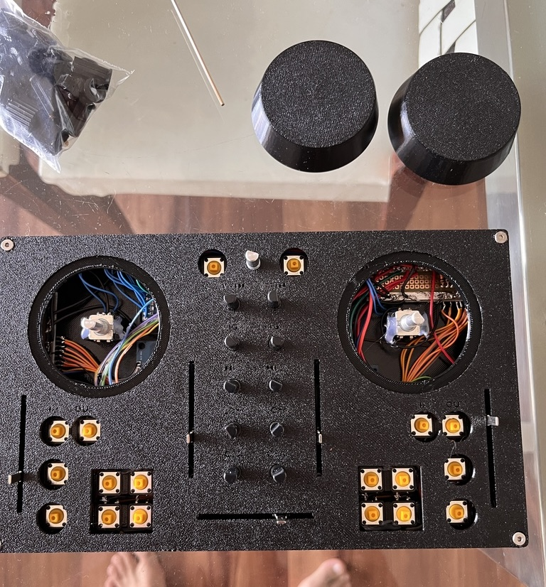
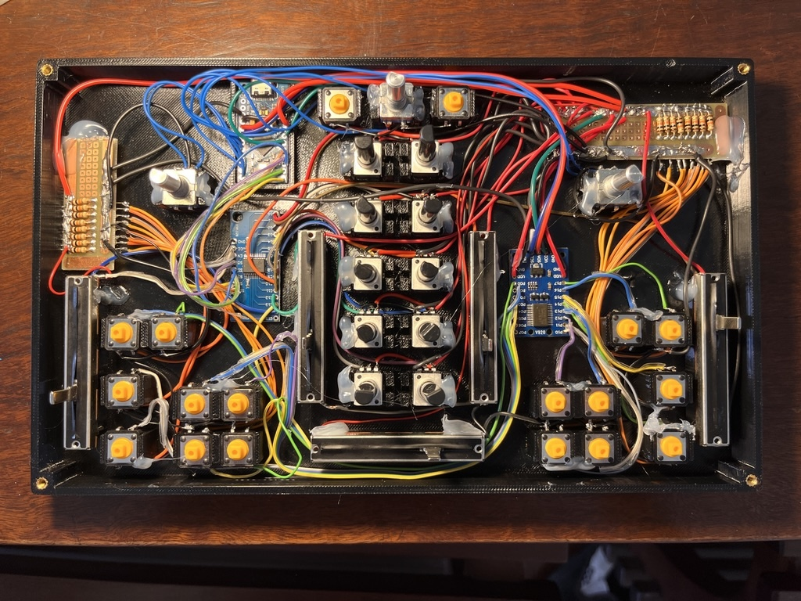
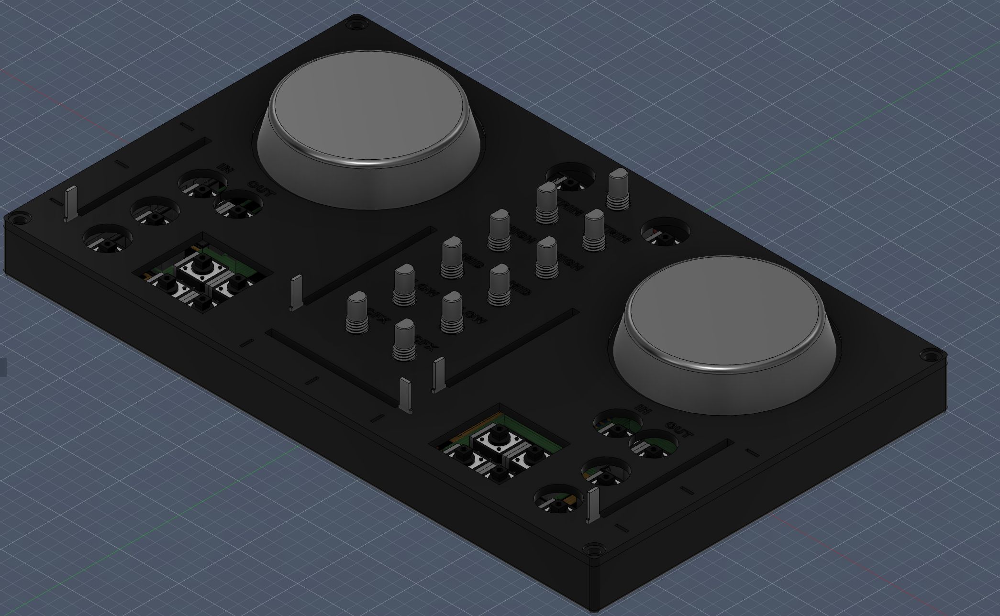
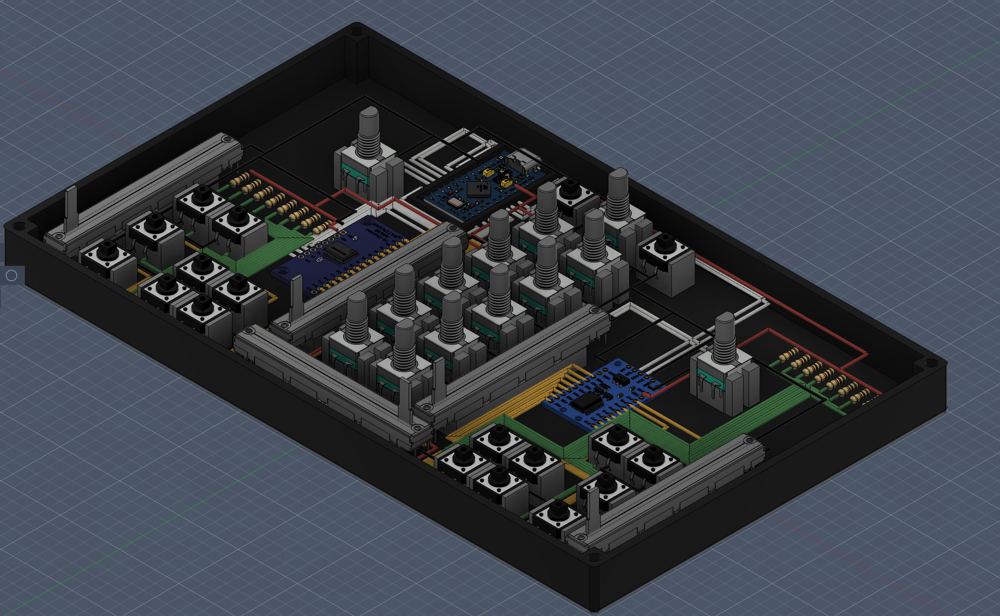
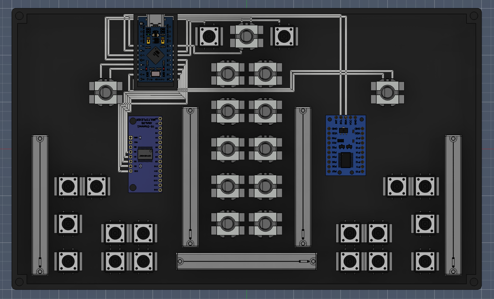
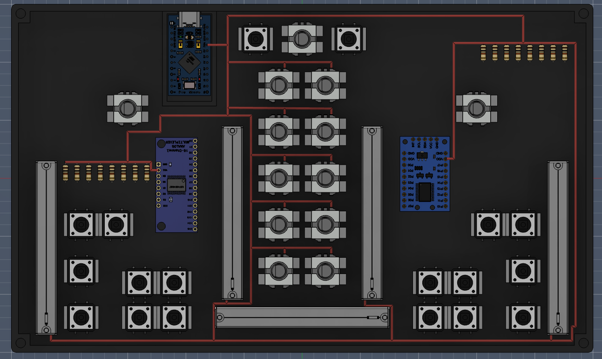
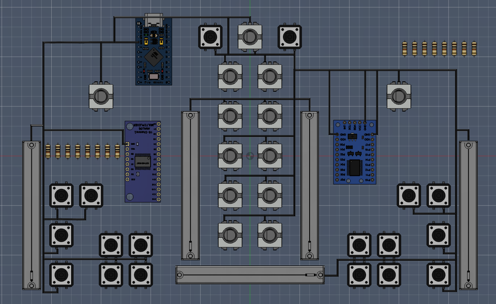
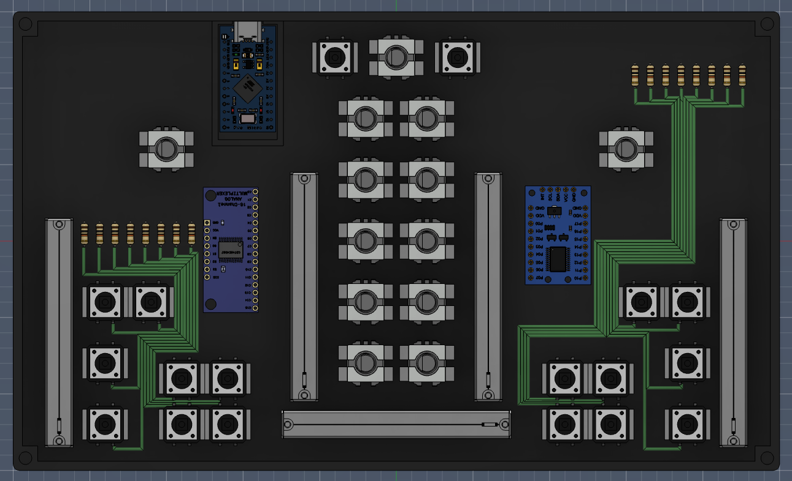
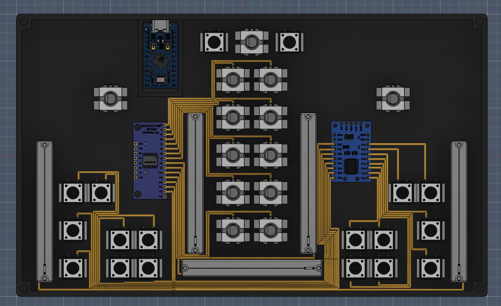

# DIY DJ Controller

[](https://github.com/jueta/CDJ/actions/workflows/firmware.yml)

Homemade CDJ-style DJ controller with a 3D-printed enclosure, hand-built electronics, and custom firmware.

This repository documents:
- the current stable Mixxx prototype
- the firmware and Mixxx mapping that make it work
- the next hardware direction for a cleaner v2 build
- open-source hardware, firmware, and documentation for builders who want to contribute


<table>
  <tr>
    <td></td>
    <td></td>
  </tr>
  <tr>
    <td></td>
    <td></td>
  </tr>
</table>

## Status

- `v1` is the stable Mixxx-focused version
- the controller has been built, flashed, and used successfully as a working prototype
- Rekordbox was tested, but the jog wheels never became usable enough for a real workflow
- because of that, Rekordbox is not a supported target for this hardware revision

## Current Version

- `MCU`: SparkFun Pro Micro / ATmega32U4
- `Firmware`: PlatformIO + Arduino + `MIDIUSB`
- `Inputs`: `PCF8575` for buttons, `74HC4067` for analog controls, 3 rotary encoders
- `Mechanical`: custom 3D-printed enclosure designed in Fusion 360
- `Software target`: Mixxx

The current prototype includes:
- two-deck transport and loop control
- EQ, filter, gain, volume, tempo, and crossfader control
- jog wheels
- music browsing and load controls

## V1 Hardware Summary

- `MCU`: SparkFun Pro Micro / ATmega32U4
- `Button expander`: `PCF8575` for 16 buttons
- `Analog mux`: `74HC4067` for 15 potentiometers
- `Encoders`: 3 total
  - 1 browse encoder
  - 2 jog wheel encoders
- `Encoder model`: Alps `EC11E` vertical rotary encoder, `H20mm`
- `Button model`: Omron `B3F-40xx`, 12x12 mm THT tactile switch
- `Direct buttons on MCU`: `A1`, `A2`, `A3`
- `Potentiometers`: 15 total
  - `Linear model`: `B103` 75 mm linear slide potentiometer, 10 kOhm
  - `Rotary model`: TT Electronics `P0915N` vertical rotary potentiometer

## V1 Materials List

This is the practical parts list for rebuilding the current working v1 prototype.

| Qty | Material | Notes |
| --- | --- | --- |
| 1 | 🧠 Microcontroller | Arduino Pro Micro - ATmega32U4 - USB Type C |
| 18 | 🔘 Buttons | B3F-4055 - 12x12x7.3mm |
| 3 | 🔄 Rotary Encoders | EC11 - 15mm shaft lenght - D shaft - without push button |
| 10 | 🎛️ Rotary Potentiometers | R0902N - B103 - 10kΩ - 23mm shaft lenght - D shaft |
| 5 | 🎚️ Slide Potentiometers | 60mm - B103 - 10kΩ - 15mm handle lenght |
| 1 | 🔘 Buttons pin expander | `PCF8575` / HW-331 16-bit I2C IO expander module |
| 1 | 🎛️ Potentiometers pin expander | `CD74HC4067` / `74HC4067` 16-channel analog multiplexer module |
| 1 | 3D-printed enclosure body | `3D models/DIY_CDJ_body.stl`. |
| 1 | 3D-printed enclosure lid | `3D models/DIY_CDJ_lid.stl`. |
| 1 each | 3D-printed caps and control parts | `crossfader.stl`, `cue.stl`, `encoder.stl`, `joggingWheel.stl`, `knob.stl`, `performance-pad.stl`, and `play-pause.stl`. |
| As needed | Hookup wire, solder, and 2.54 mm headers | The stable v1 prototype is hand-wired, not PCB-based. |

The firmware currently defines 3 direct music-selection inputs on `A1`, `A2`, and `A3`, but the KiCad v1 schematic places 18 tactile switches total. Add one extra switch if you wire all 3 direct inputs. The schematic also contains 16 resistor placeholders with no values or footprints assigned yet, so treat those as schematic TODOs rather than an order-ready BOM line.

## V1 Wiring Summary

These are the important firmware-defined connections for the current working Mixxx version.

### Wiring Diagrams

<p>
  
  
  
  
  
</p>

### I2C / Button Expander

- `SDA` -> pin `2`
- `SCL` -> pin `3`
- `PCF8575` address is auto-detected on boot in the `0x20` to `0x27` range

### 74HC4067 Multiplexer

- `MUX signal` -> `A0`
- `S0` -> pin `15`
- `S1` -> pin `14`
- `S2` -> pin `16`
- `S3` -> pin `10`

### Rotary Encoders

- `Browse encoder` -> pins `4` and `5`
- `Jog wheel 1` -> pins `8` and `9`
- `Jog wheel 2` -> pins `6` and `7`

### Direct Buttons

- `A3` -> note `76`
- `A2` -> note `77`
- `A1` -> note `78`

## V1 Current Input Map

### PCF8575 Buttons

- `Button 0` -> Deck 1 Loop Out
- `Button 1` -> Deck 1 Loop In
- `Button 2` -> Deck 1 Hotcue 3
- `Button 3` -> Deck 1 Hotcue 4
- `Button 4` -> Deck 1 Hotcue 1
- `Button 5` -> Deck 1 Hotcue 2
- `Button 6` -> Deck 1 Cue
- `Button 7` -> Deck 1 Play/Pause
- `Button 8` -> Deck 2 Hotcue 4
- `Button 9` -> Deck 2 Hotcue 3
- `Button 10` -> Deck 2 Hotcue 1
- `Button 11` -> Deck 2 Hotcue 2
- `Button 12` -> Deck 2 Cue
- `Button 13` -> Deck 2 Play/Pause
- `Button 14` -> Deck 2 Loop In
- `Button 15` -> Deck 2 Loop Out

### Potentiometers

- `Pot 0 / CC 10` -> Deck 1 Gain
- `Pot 1 / CC 11` -> Deck 2 Gain
- `Pot 2 / CC 12` -> Deck 1 High EQ
- `Pot 3 / CC 13` -> Deck 2 High EQ
- `Pot 4 / CC 14` -> Deck 1 Mid EQ
- `Pot 5 / CC 15` -> Deck 2 Mid EQ
- `Pot 6 / CC 16` -> Deck 1 Low EQ
- `Pot 7 / CC 17` -> Deck 2 Low EQ
- `Pot 8 / CC 18` -> Deck 1 Filter
- `Pot 9 / CC 19` -> Deck 2 Filter
- `Pot 10 / CC 20` -> Deck 2 Volume
- `Pot 11 / CC 21` -> Deck 2 Tempo
- `Pot 12 / CC 22` -> Deck 1 Volume
- `Pot 13 / CC 23` -> Crossfader
- `Pot 14 / CC 24` -> Deck 1 Tempo

### Browser And Jog Controls

- `Browse encoder / CC 25` -> library scroll
- `A1 / note 78` -> Load selected track to Deck 1
- `A2 / note 77` -> Load selected track to Deck 2
- `A3 / note 76` -> Enter or expand selected folder
- `Jog wheel on pins 8/9 / CC 26` -> currently mapped to Deck 2
- `Jog wheel on pins 6/7 / CC 27` -> currently mapped to Deck 1

## V1 Firmware

The current firmware lives in `CDJ_firmware/src/main.cpp`.

### Current Behavior

- auto-detects the `PCF8575` on boot
- configures the expander pins as input pull-high
- reads 16 buttons through the `PCF8575`
- reads 15 analog controls through the `74HC4067`
- reads 3 rotary encoders
- reads direct top buttons on `A1`, `A2`, and `A3`
- sends MIDI note and CC messages through `MIDIUSB`
- uses an additional filter on the browse encoder to reduce event spam in Mixxx

### Build Target

`CDJ_firmware/platformio.ini` currently targets:

```ini
[env:sparkfun_promicro16]
platform = atmelavr
board = sparkfun_promicro16
framework = arduino
lib_deps =
  arduino-libraries/MIDIUSB @ ^1.0.5
```

## Repo Layout

- `CDJ_firmware/` - firmware source and PlatformIO config
- `controllers/mixx_Mapping/` - Mixxx XML and JS mapping
- `controllers/rekordbox/` - Rekordbox mapping reference and notes
- `pics/` - renders and prototype photos
- `reference circuits/` - circuit reference images
- `PCB/` - KiCad schematic, PCB, and custom symbols/footprints
- `3D models/` - printable parts and Fusion 360 source archive
- `CONTRIBUTING.md` - contribution guide
- `.github/` - issue templates, pull request template, and CI workflow

## Source Of Truth

- `Firmware`: `CDJ_firmware/src/main.cpp`
- `Mixxx XML mapping`: `controllers/mixx_Mapping/DJC-DIY.midi.xml`
- `Mixxx JS mapping`: `controllers/mixx_Mapping/DJC-DIY-scripts.js`

For exact control behavior, use those files instead of this README.

## Contributing

Contributions are welcome. The most useful contributions right now are practical build reports, Mixxx mapping fixes, firmware cleanup, PCB review, parts substitutions, enclosure fit notes, and documentation improvements.

Before starting a large hardware or firmware change, open an issue so the direction can be discussed. Small documentation fixes can go straight to a pull request.

Useful starter work:

- test the current Mixxx mapping on another OS or Mixxx version
- document compatible Pro Micro clones, encoders, buttons, and potentiometers
- improve wiring photos or assembly notes
- review the KiCad v1 schematic and PCB TODOs
- add real build notes for 3D-print settings and fit adjustments

See `CONTRIBUTING.md` for the full workflow and pull request checklist.

## Getting Started

### Firmware

1. Install [PlatformIO](https://platformio.org/) in VS Code.
2. Open `CDJ_firmware/`.
3. Connect the SparkFun Pro Micro by USB.
4. Build or upload:

```bash
pio run
pio run --target upload
```

### Mixxx

Copy these files into your Mixxx controller mapping folder:

- `controllers/mixx_Mapping/DJC-DIY.midi.xml`
- `controllers/mixx_Mapping/DJC-DIY-scripts.js`

Then enable the mapping in Mixxx.

## Important Notes

- The stable path for this project is Mixxx, not Rekordbox.
- The prototype is still hand-wired and not PCB-based yet.
- The current jog wheel assignment is swapped between physical control and deck mapping.
- Rekordbox support should be treated as future hardware research, not a feature of this version.

## V2 Plan

V2 is a hardware redesign focused on one goal: keep a single `USB-C` cable to the computer and add a built-in `3.5 mm` headphone cue output.

- `Master` stays on the computer side
- the controller provides only `Headphones / Cue`
- the project stays Mixxx-first

### Electronics Plan

- `Prototype MCU`: `SparkFun Thing Plus ESP32-S3`
- `Custom PCB MCU`: `ESP32-S3-WROOM-1`
- `Headphone audio`: `Adafruit TLV320DAC3100` or equivalent small I2S headphone DAC/codec
- `External ports`: one `USB-C`, one `3.5 mm TRS` headphone jack
- `Existing controls to keep initially`: `PCF8575`, `74HC4067`, jog encoders, browse encoder, buttons, and potentiometers

### Core Connections

- `USB-C` -> `ESP32-S3`
- `ESP32-S3 I2S` -> `TLV320DAC3100` audio data
- `ESP32-S3 I2C` -> `TLV320DAC3100` configuration
- `TLV320DAC3100` -> `3.5 mm TRS` headphone jack
- `ESP32-S3` -> existing control hardware

### Firmware Work

- port the controller logic from `ATmega32U4` to `ESP32-S3`
- expose one composite USB device with `MIDI + audio`
- keep the current control behavior as close to `v1` as possible
- send Mixxx cue audio to the headphone DAC

### Rekordbox Note

`ESP32-S3` is a much better platform for future USB experiments, but it does not guarantee Rekordbox compatibility or working jog wheels. V2 should still be treated as a Mixxx-first design.

## License

This project uses separate licenses by file type:

| Files | License |
| --- | --- |
| Firmware and controller mappings | GNU General Public License v3.0 only (`GPL-3.0-only`) |
| PCB, wiring, CAD, and 3D hardware design files | CERN Open Hardware Licence Version 2 - Strongly Reciprocal (`CERN-OHL-S-2.0`) |
| Documentation, photos, videos, and other media | Creative Commons Attribution 4.0 International (`CC-BY-4.0`) |

See `LICENSE.md`, `LICENSE-SOFTWARE.txt`, `LICENSE-HARDWARE.txt`, and `LICENSE-DOCS.txt` for details.

This project was inspired by my friend [@mandiclab](https://github.com/mandiclab) and the [djc-diy](https://github.com/mandiclab/djc-diy) project.
